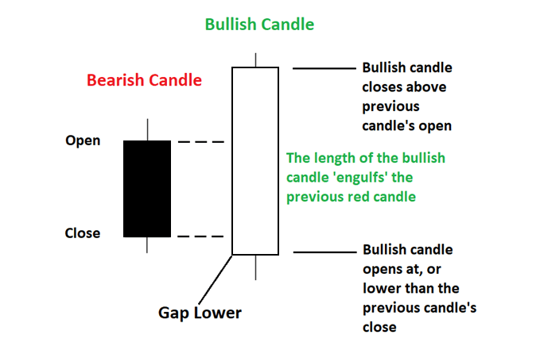
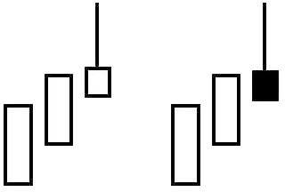
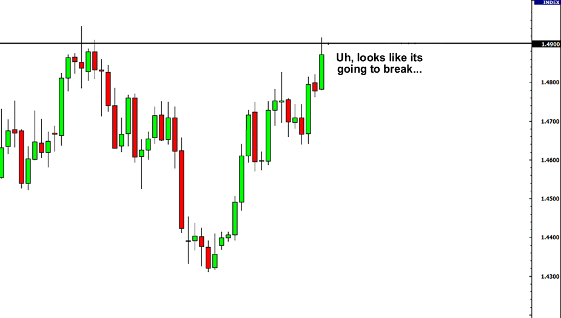

# Machine Learning Algorithmic Bot - ReadMe

## Overview

A trading robot is a software program that utilizes algorithms and statistical models to analyze financial data and automate the process of buying and selling financial instruments such as stocks, currencies, or commodities.

In the case of this particular trading robot, it is specifically designed to trade on the foreign exchange market, using Python as its programming language. The bot uses a combination of technical analysis and machine learning to identify trading opportunities by analyzing past and present price action and market trends.

One of the key features of this trading robot is its ability to detect specific candlestick patterns, such as Engulfing or Shooting Star, which can indicate potential changes in market direction. The robot also incorporates support and resistance levels into its analysis to determine the best entry and exit points for trades.

By using machine learning, the trading robot can continuously learn from its trades and improve its performance over time, adapting to changing market conditions and becoming increasingly accurate in its predictions.

Overall, this trading robot is designed to operate autonomously, taking advantage of trading opportunities in the foreign exchange market and making decisions based on a combination of technical analysis and machine learning algorithms.

## Requirements

- Python 3.x
- datetime
- time
- pandas_ta
- pytz
- MetaTrader5
- pandas
- numpy

## Usage

The script will automatically place trades based on the configured settings and technical indicators. You can also manually place trades through the API. 

**Please note: Trading in forex or any other financial market carries a high level of risk and may not be suitable for all investors. It is important to do your own research and consider your own financial situation before making any trades.**

---

# DETAILED CODE OVERVIEW

Installing neccessary packages

'''python
>import pandas as pd  
>from datetime import datetime
>import time
>import pandas_ta as ta
>import pytz                                                         
>import MetaTrader5 as mt5
'''

### Login Details

Connecting to your trading platform

'''python
>
>try:     
>    my_login = 0000000
>    my_password = 'your_password'
>    my_server = 'your_platform_server'
>    my_path = "C://File Path To Your Terminal/FxPro - MetaTrader 5/terminal64.exe"
>
>    if not mt5.initialize(path=my_path, login=my_login, server=my_server, password=my_password):
>        print("initialize() failed, error code =",mt5.last_error())
>        quit()
>    
>    authorized = mt5.login(my_login, my_password, my_server)  
>
>    if authorized:
>        print("Connected to Trading Account #{}".format(my_login))
>    else:
>        print("Failed to connect at account #{}, error code: {}".format(my_login, mt5.last_error()))
>except:
>    print("\n\n\n---Could not connect to Metatrader---")
>
'''

### [Engulfing](https://www.babypips.com/forexpedia/engulfing-pattern)

*isEngulfing* function takes a single argument *l* and checks if a given candlestick chart pattern is an engulfing candle pattern. The function calculates the difference between the open and close prices of the current and previous candlestick and applies criteria to determine if the current candlestick is a bullish or bearish engulfing pattern. 
The function returns 1 for a bullish engulfing pattern, 2 for a bearish engulfing pattern, or 0 if none of the criteria are met.

'''python

def isEngulfing(l):                                                 
    row = l
    bodydiff[row] = abs(open[row]-close[row])
    if bodydiff[row]<0.400000:
        return 0

    bodydiffmin = 0.002
    if (bodydiff[row]>bodydiffmin and bodydiff[row-1]>bodydiffmin and
        open[row-1]<close[row-1] and
        open[row]>close[row] and 
        (open[row]-close[row-1])>=-0e-5 and close[row]<open[row-1]): #+0e-5 -5e-5
        return 1

    elif(bodydiff[row]>bodydiffmin and bodydiff[row-1]>bodydiffmin and
        open[row-1]>close[row-1] and
        open[row]<close[row] and 
        (open[row]-close[row-1])<=+0e-5 and close[row]>open[row-1]):#-0e-5 +5e-5
        return 2
    else:
        return 0
    
'''

### [Shooting Star](https://www.babypips.com/forexpedia/shooting-star#:~:text=A%20Shooting%20Star%20is%20a,except%20that%20it%20is%20bearish.)

*isStar* function that takes an index *l* of a candlestick in a dataset. The function calculates the differences between the high, low, open, and close values of the candlestick and checks if it's a Shooting Star or an Inverted Hammer. 
If the candlestick is either of the two, the function returns 1 or 2 respectively, otherwise, it returns 0. The function uses different ratios and thresholds to determine if the candlestick meets the criteria of a Shooting Star or an Inverted Hammer.

'''python

def isStar(l):                                                           
    bodydiffmin = 0.0020
    row = l
    highdiff[row] = high[row]-max(open[row],close[row])
    lowdiff[row] = min(open[row],close[row])-low[row]
    bodydiff[row] = abs(open[row]-close[row])

    if bodydiff[row]<0.010000:
        return 0

    ratio1[row] = highdiff[row]/bodydiff[row]
    ratio2[row] = lowdiff[row]/bodydiff[row]

    if (ratio1[row]>1 and lowdiff[row]<0.2*highdiff[row] and bodydiff[row]>bodydiffmin):
        return 1
    elif (ratio2[row]>1 and highdiff[row]<0.2*lowdiff[row] and bodydiff[row]>bodydiffmin):
        return 2
    else:
        return 0

'''

### [Support & Resistance](https://www.babypips.com/learn/forex/candlestick_with_support_and_resistance)

*support* and *resistance* functions check whether a given candle in a DataFrame is a valid support or resistance level. The 'support' function takes four arguments and compares the low price of the current candle with the low prices of the 'n1' candles before it and the 'n2' candles after it. 
It returns 1 if the low price of all these candles is less than or equal to the low price of the current candle, otherwise, it returns 0. 

Similarly, the *resistance* function checks if the current candle is a valid resistance level by comparing its high price with the high prices of the 'n1' candles before it and the 'n2' candles after it. It returns 1 if the high price of all these candles is greater than or equal to the high price of the current candle, otherwise, it returns 0

'''python

def support(df1, l, n1, n2): #n1 n2 before and after candle l
    for i in range(l-n1+1, l+1):
        if(df1.low[i]>df1.low[i-1]):
            return 0
    for i in range(l+1,l+n2+1):
        if(df1.low[i]<df1.low[i-1]):
            return 0
    return 1

def resistance(df1, l, n1, n2): #n1 n2 before and after candle l
    for i in range(l-n1+1, l+1):
        if(df1.high[i]<df1.high[i-1]):
            return 0
    for i in range(l+1,l+n2+1):
        if(df1.high[i]>df1.high[i-1]):
            return 0
    return 1

'''

*closeResistance* function determines if the closing price of a candlestick is near a resistance level by taking in the index of the candlestick, a list of resistance levels, a limit value, and a DataFrame. It checks if the list of resistance levels is empty, then checks if the closing price or the maximum of the open and close prices of the candlestick is within a certain limit of the nearest resistance level in the list. 
Finally, it checks if the minimum of the open and close prices of the candlestick is less than the nearest resistance level and if the low price of the candlestick is less than the nearest resistance level. If all of these conditions are met, the function returns 1 indicating that the closing price of the candlestick is near a resistance level. Otherwise, it returns 0.

'''python

def closeResistance(l,levels,lim,df1):                                 
    if len(levels)==0:
        return 0
    c1 = abs(df1.high[l]-min(levels, key=lambda x:abs(x-df1.high[l])))<=lim
    c2 = abs(max(df1.open[l],df1.close[l])-min(levels, key=lambda x:abs(x-df1.high[l])))<=lim
    c3 = min(df1.open[l],df1.close[l])<min(levels, key=lambda x:abs(x-df1.high[l]))
    c4 = df1.low[l]<min(levels, key=lambda x:abs(x-df1.high[l]))
    if( (c1 or c2) and c3 and c4 ):
        return 1
    else:
        return 0

'''
    
*closeSupport* function takes four arguments, including the index of a row in a DataFrame object, a list of support levels, a minimum difference value, and the DataFrame object that contains the low, high, open, and close values. 
The function checks if the list of support levels is empty and returns 0 if it is. If not, it computes four conditions to check if the current low value is close enough to a support level for a valid support signal. The function returns 1 if any of the four conditions are true, otherwise, it returns 0.

'''python

def closeSupport(l,levels,lim,df1):                                   
    if len(levels)==0:
        return 0
    c1 = abs(df1.low[l]-min(levels, key=lambda x:abs(x-df1.low[l])))<=lim
    c2 = abs(min(df1.open[l],df1.close[l])-min(levels, key=lambda x:abs(x-df1.low[l])))<=lim
    c3 = max(df1.open[l],df1.close[l])>min(levels, key=lambda x:abs(x-df1.low[l]))
    c4 = df1.high[l]>min(levels, key=lambda x:abs(x-df1.low[l]))
    if( (c1 or c2) and c3 and c4 ):
        return 1
    else:
        return 0

'''

This loop that iterates over the rows of the DataFrame and checks if each candlestick is in a support or resistance zone by looking at the surrounding *n1* and *n2* candles, and appending the corresponding high or low values to lists *ss* and *rr*, respectively.

'''python

n1 = 2
n2 = 2
backCandles = 120
signal = [0] * length

try:
    for row in range(backCandles, len(df)-n2):
        ss = []
        rr = []
        for subrow in range(row-backCandles+n1, row+1):
            if support(df, subrow, n1, n2):
                ss.append(df.low[subrow])
            if resistance(df, subrow, n1, n2):
                rr.append(df.high[subrow])
                                            
except KeyError:
    print("\n---An error occured---")

'''